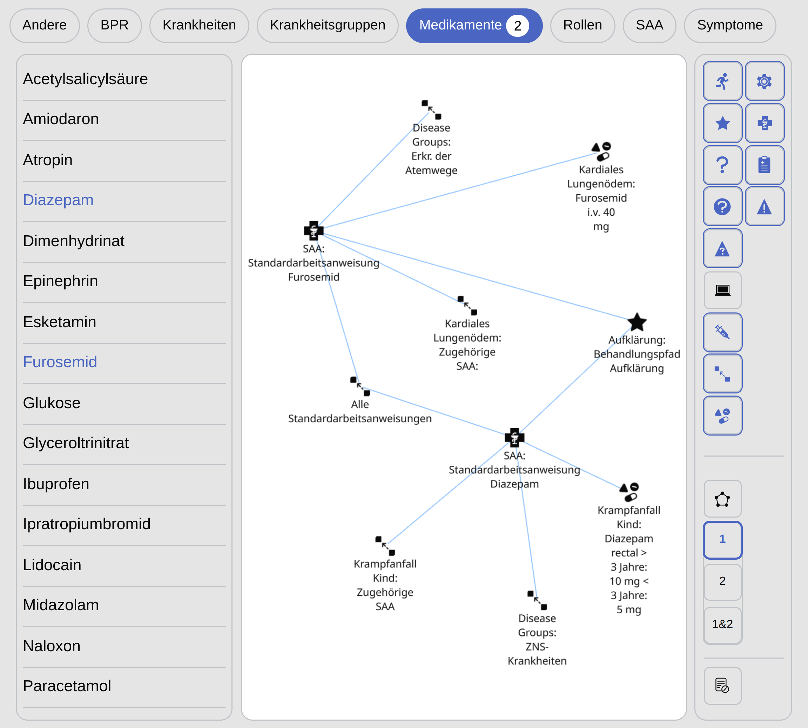
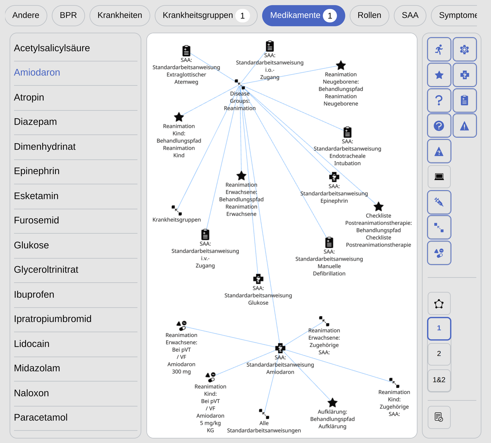
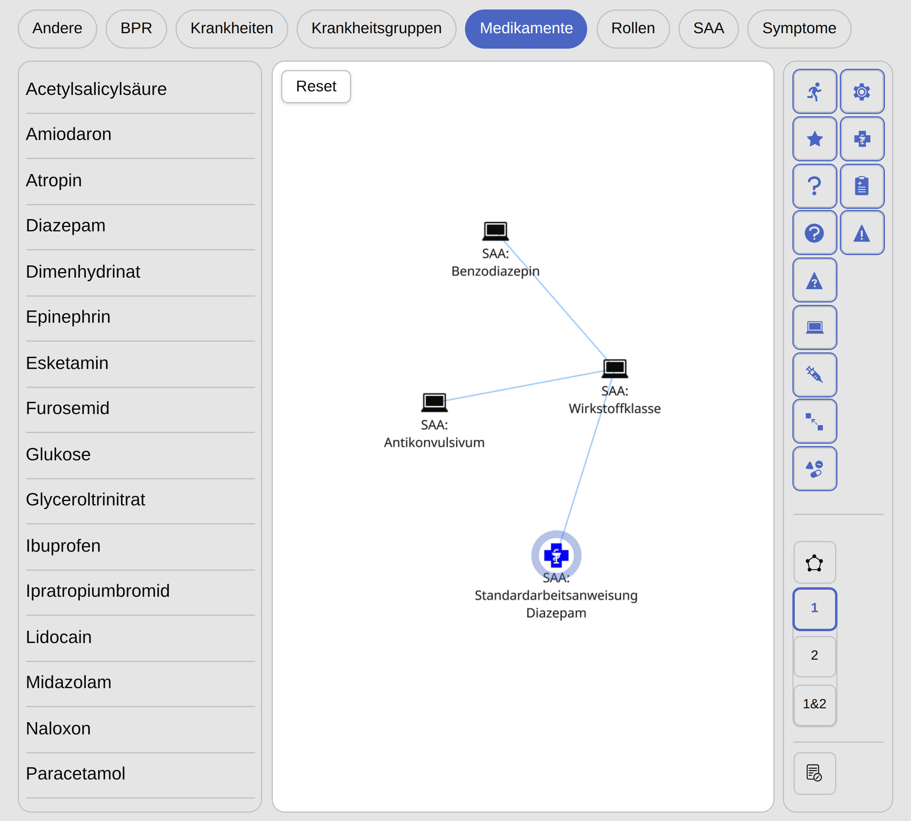
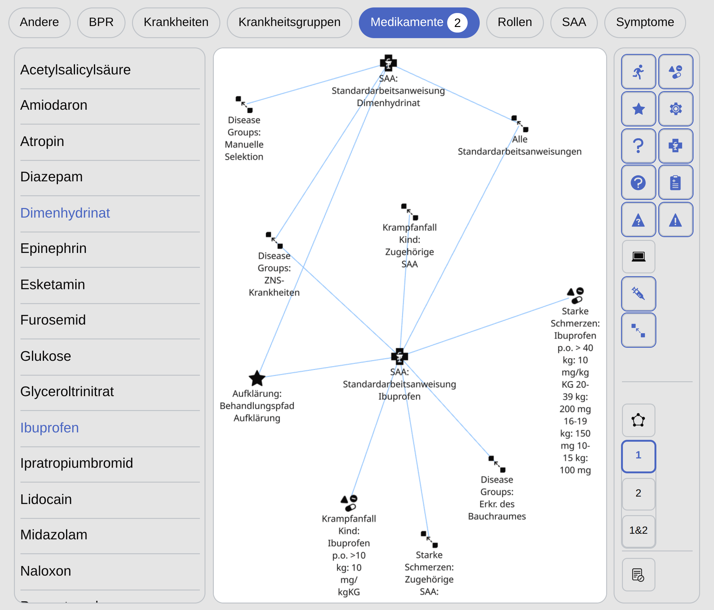
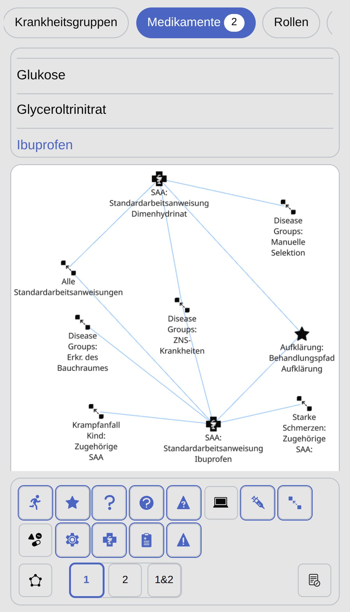

<table align="center">
  <tr>
    <td colspan="3" align="center">
      <strong>Demo (Desktop View)</strong> 
      
    </td>
  </tr>

  <tr>
    <td align="center">
      <strong>Filtering</strong> 
      
    </td>
    <td align="center">
      <strong>Expansion</strong> 
      
    </td>
    <td align="center">
      <strong>Category Selection</strong> 
      
    </td>
  </tr>

  <tr>
    <td colspan="1" align="center">
      <strong>Tablet View</strong> 
      
    </td>
    <td colspan="2" align="center">
      <strong>Mobile View</strong> 
      
    </td>
  </tr>
</table>

